# compressibleSPH

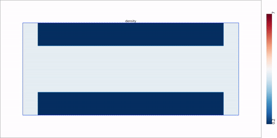

A GPU-oriented Python package for compressible Smoothed Particle Hydrodynamics (SPH) experiments and benchmarks.

The project is organized around reusable builders for simulation configuration, interchangeable SPH schemes, adaptive time integration, case setup helpers, and export/import utilities for trajectories and postprocessing.

## What This Package Implements

### Core SPH Schemes

The package currently exposes three compressible SPH schemes via `CompressibleSPHScheme`:

- `Monaghan`
- `CompSPH`
- `CRKSPH`

Scheme dispatch is handled by `buildScheme(...)` in `src/compressibleSPH/schemes/builder.py`.

### Kernels

Kernel selection is part of `SimulationConfig.kernel` (type `KernelFunctions`, imported from `sphWarpCore`).

The parser helper `parseKernelFunctions(...)` accepts any kernel enum name exposed by your installed `sphWarpCore` version.

### Integrators

Time integration is selected with `SimulationConfig.integrationScheme` (type `IntegrationSchemeType`, from `integrators`).

The helper `buildConfig(...)` returns both:

- a configured `SimulationConfig`
- the integrator object from `getIntegrator(...)`

### Spatial Operators and Support Modes

Simulation configuration includes selectable operator and support modes:

- `supportMode` (`SupportScheme`)
- `gradientMode` (`GradientScheme`)
- `laplacianMode` (`LaplacianScheme`)
- `samplingScheme` (`SamplingScheme`)

### Viscosity Switches

`ViscositySwitch` includes:

- `Balsara1995`
- `Colagrossi2004`
- `CullenDehnen2010`
- `CullenHopkins`
- `MorrisMonaghan1997`
- `Rosswog2000`
- `NoneSwitch`

### Adaptive Support Schemes

`AdaptiveSupportScheme` includes:

- `NoScheme`
- `Monaghan`
- `Owen`

### Energy Schemes

`EnergyScheme` includes:

- `equalWork`
- `PdV`
- `diminishing`
- `monotonic`
- `hybrid`
- `CRK`

### I/O and Reproducibility Utilities

The package provides trajectory/state serialization utilities:

- `prepExport(...)`
- `exportSimulationSystem(...)`
- `importSimulationSystem(...)`
- `importConfigs(...)`

These write/read HDF5 state data and JSON config metadata for reproducible runs.

## Package Layout

- `src/compressibleSPH/configurations/`: simulation and scheme configuration dataclasses/builders
- `src/compressibleSPH/schemes/`: scheme implementations and scheme builder
- `src/compressibleSPH/systems/`: state/system containers
- `src/compressibleSPH/modules/`: runtime modules (for example timestep support)
- `src/compressibleSPH/sample/`: sampling utilities
- `src/compressibleSPH/caseUtils/`: case setup helpers used by examples
- `src/compressibleSPH/io.py`: export/import and parsing helpers
- `examples/compressible/`: benchmark notebooks and generated media

## Environment Setup

Recommended setup uses a dedicated conda environment and editable installs for backend repositories.

### 1) Create and prepare conda environment

```bash
conda create -n 'warp' python=3.13
conda activate warp
conda install -c anaconda ipykernel -y
conda install nvidia/label/cuda-13.0.0::cuda-toolkit cudnn
pip install toml scipy numba tqdm h5py matplotlib ipywidgets ipympl imageio scikit-image imageio_ffmpeg seaborn pandas
pip install warp-lang torch
```

### 2) Clone backend repositories

```bash
git clone https://github.com/wi-re/integrators
git clone https://github.com/wi-re/sphPlotting
git clone https://github.com/wi-re/warpSPH
```

### 3) Install backends in editable mode

```bash
cd integrators && pip install -e . && cd ..
cd sphPlotting && pip install -e . && cd ..
cd warpSPH && pip install -e . && cd ..
```

Current status: cloning and editable installs are the accepted setup path for now.

## Quick Start

If you are running directly from this repository, ensure `src` is on your Python path:

```bash
export PYTHONPATH="$PWD/src:$PYTHONPATH"
```

Minimal usage pattern:

```python
import torch
from compressibleSPH import *

# Build global simulation config + integrator
config, integrator = buildConfig(
    dim=1,
    dt=1e-3,
    adaptiveDt=True,
    cflFactor=0.3,
)

# Pick an SPH scheme
scheme = CompressibleSPHScheme.CRKSPH
SimulationSystem, SimulationState, SimulationConfig, SimulationUpdate, fn, export_fn, import_fn = buildScheme(scheme)

# Build scheme-specific config
schemeConfig = SimulationConfig()
schemeConfig.gamma = 5.0 / 3.0

# Case setup is typically done with helpers in compressibleSPH.caseUtils
```

## Compressible Examples

A full gallery page with previews and embedded videos is available at:

- [examples/compressible/EXAMPLES_SUMMARY.md](examples/compressible/EXAMPLES_SUMMARY.md)

### Table of Cases

| Case | Notebook | Preview (PNG) | Video (MP4) |
|---|---|---|---|
| 01. Sod Shock Tube (1D) | [01-Sod_Shock_Tube_1D.ipynb](examples/compressible/01-Sod_Shock_Tube_1D.ipynb) |  | [MP4](examples/compressible/outputs/01-Sod_Shock_Tube.mp4) |
| 02. Linear Wave | [02-Linear_Wave.ipynb](examples/compressible/02-Linear_Wave.ipynb) | 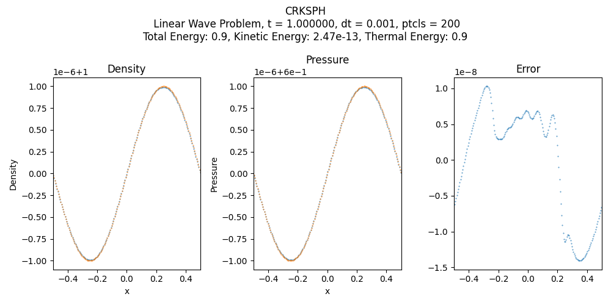 | [MP4](examples/compressible/outputs/02-Linear_wave.mp4) |
| 03. Kidder Isentropic Compression | [03-Kidder_Isentropic_Compression.ipynb](examples/compressible/03-Kidder_Isentropic_Compression.ipynb) | 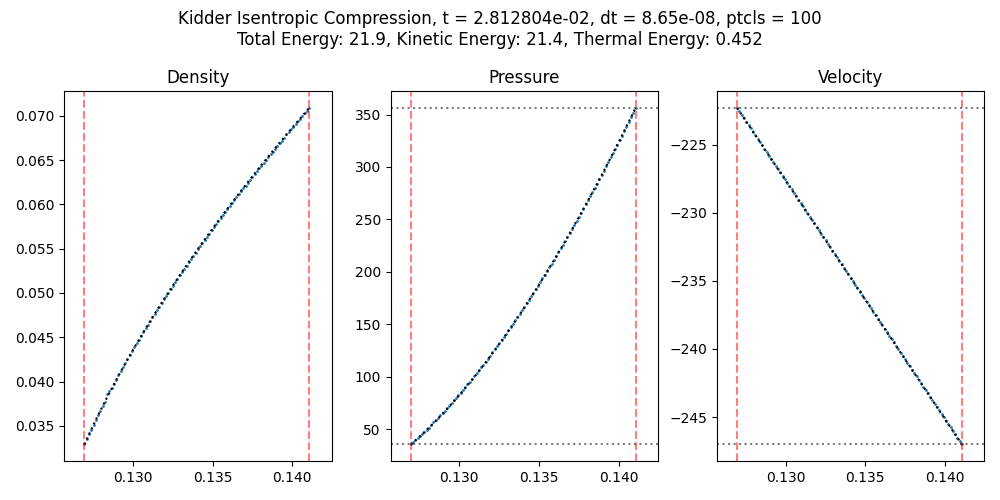 | [MP4](examples/compressible/outputs/03-Kidder_Isentropic_compression.mp4) |
| 04. Noh Implosion | [04-Noh_Implosion.ipynb](examples/compressible/04-Noh_Implosion.ipynb) | 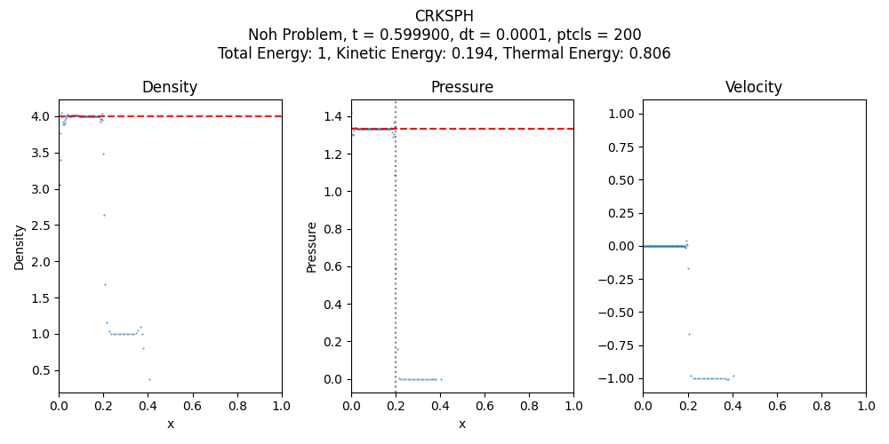 | [MP4](examples/compressible/outputs/04-Noh_Implosion.mp4) |
| 05. Woodward-Colella Double Blastwave | [05-Woodward_Colella.ipynb](examples/compressible/05-Woodward_Colella.ipynb) | 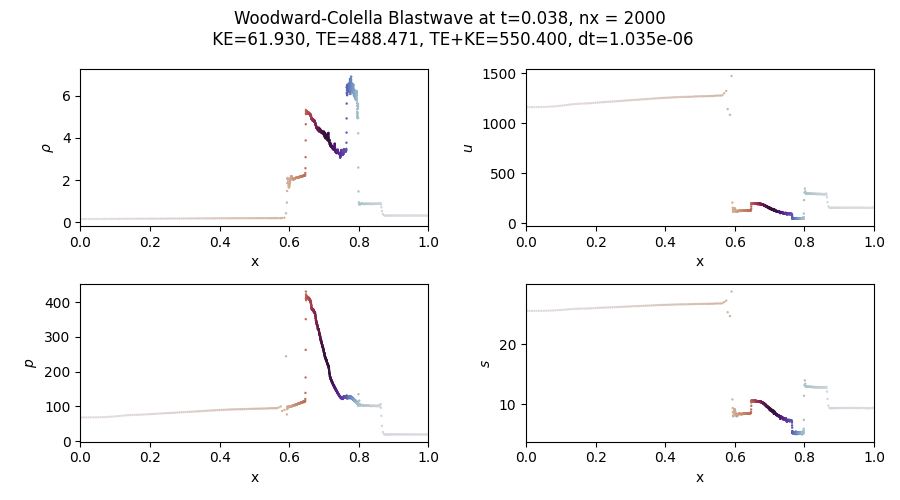 | [MP4](examples/compressible/outputs/05-Wodward_Colella_Double_Blastwave.mp4) |
| 06. Sedov-Taylor Blastwave (1D) | [06-Sedov_Taylor_Blastwave_1D.ipynb](examples/compressible/06-Sedov_Taylor_Blastwave_1D.ipynb) | 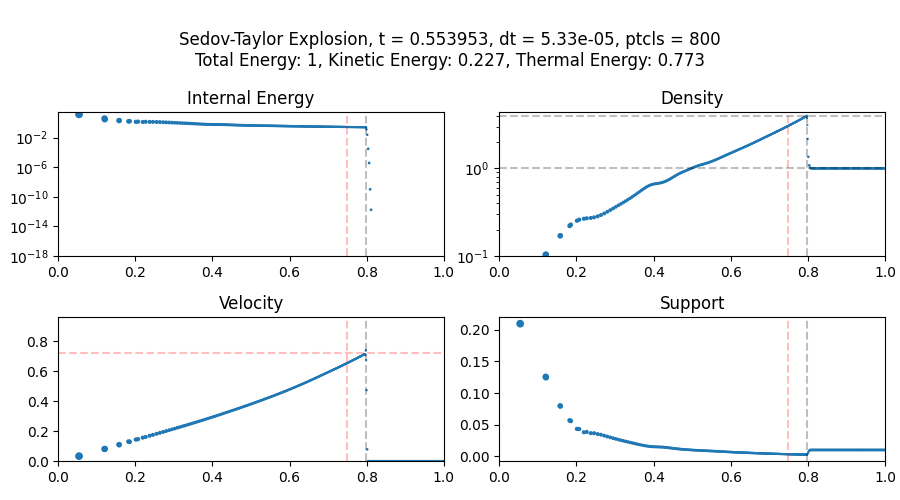 | [MP4](examples/compressible/outputs/06-Sedov_Taylor_Blastwave_1D.mp4) |
| 07. Sedov-Taylor Blastwave (2D) | [07-Sedov_Taylor_Blastwave_2D.ipynb](examples/compressible/07-Sedov_Taylor_Blastwave_2D.ipynb) | 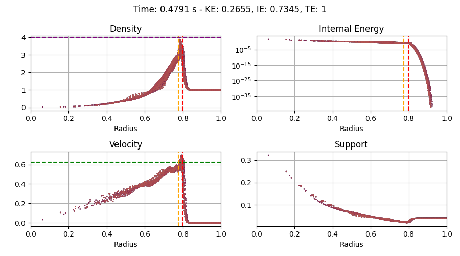 | [MP4](examples/compressible/outputs/07-Sedov_Taylor_Blastwave_2D.mp4) |
| 08. Hydrostatic | [08-Hydrostatic.ipynb](examples/compressible/08-Hydrostatic.ipynb) | 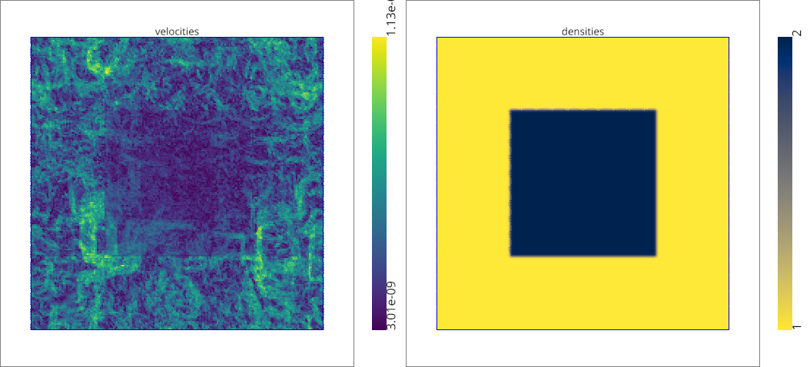 | [MP4](examples/compressible/outputs/08-Hydrostatic.mp4) |
| 09. Gresho-Chan Vortex | [09-Gresho_Chan_Vortex.ipynb](examples/compressible/09-Gresho_Chan_Vortex.ipynb) | 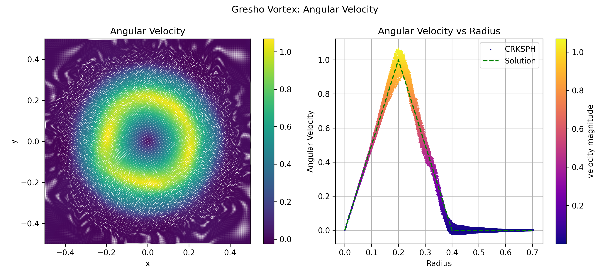 | [MP4](examples/compressible/outputs/09-Gresho_Chan_Vortex.mp4) |
| 10. Yee Vortex | [10-Yee_Vortex.ipynb](examples/compressible/10-Yee_Vortex.ipynb) | 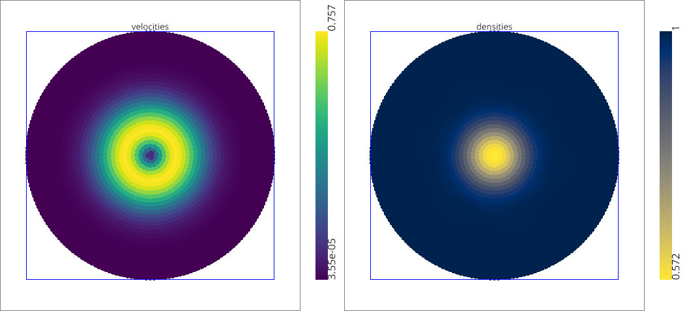 | [MP4](examples/compressible/outputs/10-Yee_Vortex.mp4) |
| 11. Shearing Noh Implosion (2D) | [11-Shearing_Noh_Implosion_2D.ipynb](examples/compressible/11-Shearing_Noh_Implosion_2D.ipynb) | 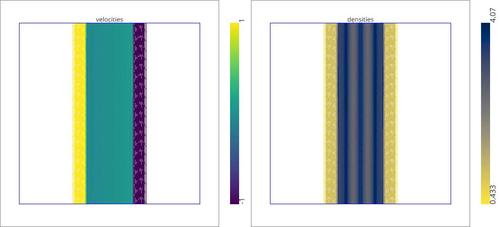 | [MP4](examples/compressible/outputs/11-Shearing_Noh_2D.mp4) |
| 12. Kelvin-Helmholtz | [12-Kelvin-Helmholtz.ipynb](examples/compressible/12-Kelvin-Helmholtz.ipynb) | 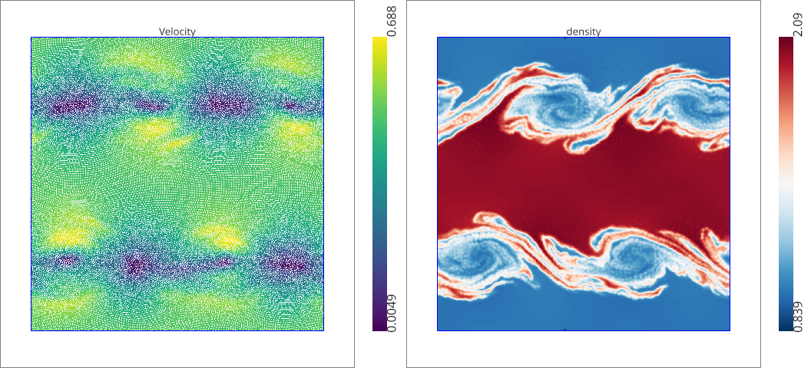 | [MP4](examples/compressible/outputs/12-Kelvin_Helmholtz.mp4) |
| 13. Rayleigh-Taylor | [13-Rayleigh_Taylor.ipynb](examples/compressible/13-Rayleigh_Taylor.ipynb) | 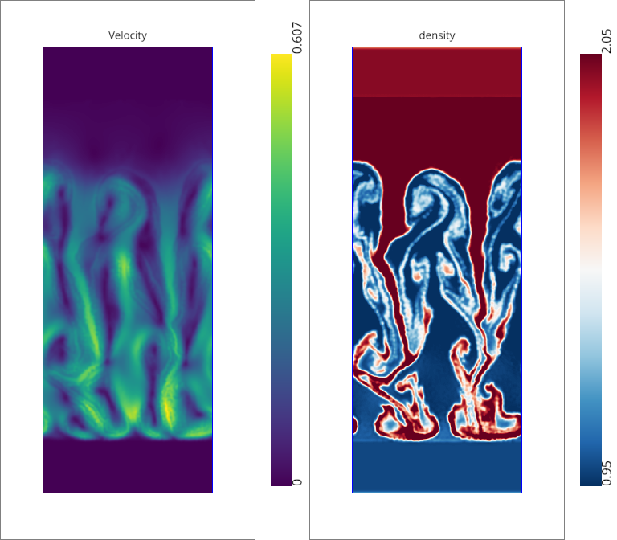 | [MP4](examples/compressible/outputs/13-Rayleigh_Taylor.mp4) |
| 14. Triple Point (Equal Resolution) | [14-Triple_point.ipynb](examples/compressible/14-Triple_point.ipynb) | 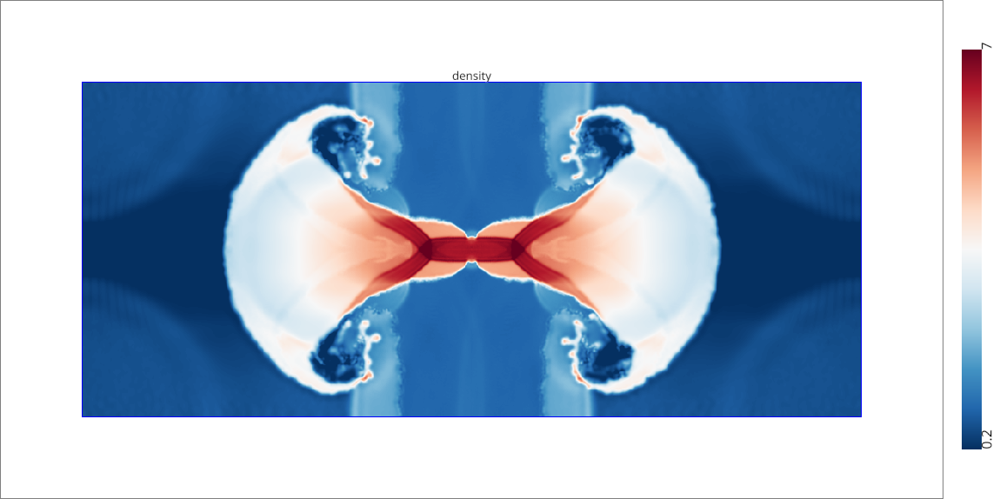 | [MP4](examples/compressible/outputs/14-Triple_Point_equal_resolution.mp4) |
| 15. Triple Point (Equal Mass) | [15-Triple_point_equalMass.ipynb](examples/compressible/15-Triple_point_equalMass.ipynb) | 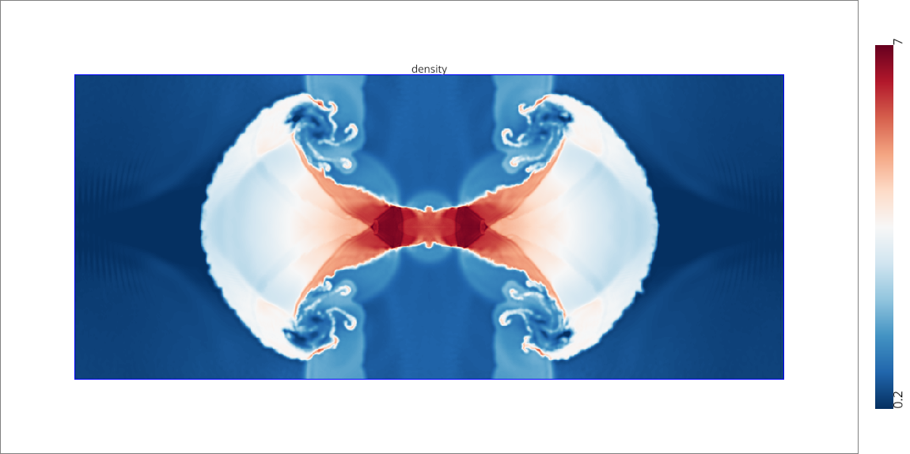 | [MP4](examples/compressible/outputs/15-Triple_Point_equal_mass.mp4) |

## Precision Note (Notebook Workflows)

In the example notebooks, floating-point precision is configured early in the import/setup cell. If precision is changed (for example float32 to float64), restart the Jupyter kernel before rerunning.
