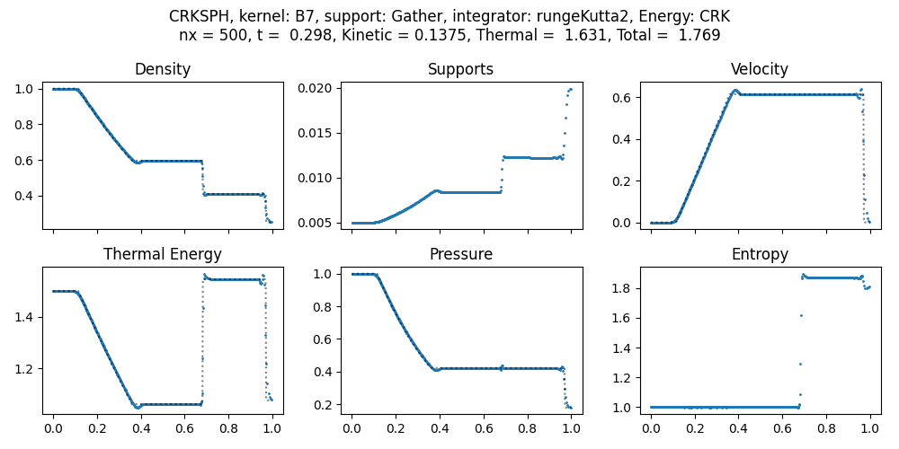

# Compressible SPH Example Gallery

This page summarizes the 15 benchmark examples in this folder.

- Static PNG previews are used to keep the page lightweight.
- Each case also includes an embedded MP4 (plus a direct link).
- Notebooks are linked for quick access.

## Quick Index

| Case | Notebook | Preview |
|---|---|---|
| 01. Sod Shock Tube (1D) | [01-sod/sod_1d.ipynb](01-sod/sod_1d.ipynb) |  |
| 02. Linear Wave | [02-Linear_Wave.ipynb](02-Linear_Wave.ipynb) |  |
| 03. Kidder Isentropic Compression | [03-Kidder_Isentropic_Compression.ipynb](03-Kidder_Isentropic_Compression.ipynb) |  |
| 04. Noh Implosion | [04-Noh_Implosion.ipynb](04-Noh_Implosion.ipynb) |  |
| 05. Woodward-Colella Double Blastwave | [05-Woodward_Colella.ipynb](05-Woodward_Colella.ipynb) |  |
| 06. Sedov-Taylor Blastwave (1D) | [06-Sedov_Taylor_Blastwave_1D.ipynb](06-Sedov_Taylor_Blastwave_1D.ipynb) |  |
| 07. Sedov-Taylor Blastwave (2D) | [07-Sedov_Taylor_Blastwave_2D.ipynb](07-Sedov_Taylor_Blastwave_2D.ipynb) |  |
| 08. Hydrostatic | [08-Hydrostatic.ipynb](08-Hydrostatic.ipynb) |  |
| 09. Gresho-Chan Vortex | [09-Gresho_Chan_Vortex.ipynb](09-Gresho_Chan_Vortex.ipynb) |  |
| 10. Yee Vortex | [10-Yee_Vortex.ipynb](10-Yee_Vortex.ipynb) |  |
| 11. Shearing Noh Implosion (2D) | [11-Shearing_Noh_Implosion_2D.ipynb](11-Shearing_Noh_Implosion_2D.ipynb) |  |
| 12. Kelvin-Helmholtz | [12-Kelvin-Helmholtz.ipynb](12-Kelvin-Helmholtz.ipynb) |  |
| 13. Rayleigh-Taylor | [13-Rayleigh_Taylor.ipynb](13-Rayleigh_Taylor.ipynb) |  |
| 14. Triple Point (Equal Resolution) | [14-Triple_point.ipynb](14-Triple_point.ipynb) |  |
| 15. Triple Point (Equal Mass) | [15-Triple_point_equalMass.ipynb](15-Triple_point_equalMass.ipynb) |  |

## Case Details (Preview + MP4)

### 01. Sod Shock Tube (1D)
Classical 1D Riemann problem with rarefaction, contact discontinuity, and shock. Own directory
([01-sod/](01-sod/)) with a resume script/notebook and a demo of the trajectory export scheme.

<video src="01-sod/outputs/01-Sod_Shock_Tube.mp4" controls width="900"></video>

[Open MP4](01-sod/outputs/01-Sod_Shock_Tube.mp4)

### 02. Linear Wave
Small-amplitude acoustic wave propagation test for phase and dissipation behavior.

<video src="outputs/02-Linear_wave.mp4" controls width="900"></video>

[Open MP4](outputs/02-Linear_wave.mp4)

### 03. Kidder Isentropic Compression
Smooth compression/expansion benchmark for entropy and adiabatic consistency.

<video src="outputs/03-Kidder_Isentropic_compression.mp4" controls width="900"></video>

[Open MP4](outputs/03-Kidder_Isentropic_compression.mp4)

### 04. Noh Implosion
Strong converging-flow shock benchmark for robustness under high compression.

<video src="outputs/04-Noh_Implosion.mp4" controls width="900"></video>

[Open MP4](outputs/04-Noh_Implosion.mp4)

### 05. Woodward-Colella Double Blastwave
Interacting strong shocks and contacts in 1D.

<video src="outputs/05-Wodward_Colella_Double_Blastwave.mp4" controls width="900"></video>

[Open MP4](outputs/05-Wodward_Colella_Double_Blastwave.mp4)

### 06. Sedov-Taylor Blastwave (1D)
Localized energy deposition driving a strong self-similar blast wave in 1D.

<video src="outputs/06-Sedov_Taylor_Blastwave_1D.mp4" controls width="900"></video>

[Open MP4](outputs/06-Sedov_Taylor_Blastwave_1D.mp4)

### 07. Sedov-Taylor Blastwave (2D)
Radial blast expansion benchmark for isotropy and shock-front shape.

<video src="outputs/07-Sedov_Taylor_Blastwave_2D.mp4" controls width="900"></video>

[Open MP4](outputs/07-Sedov_Taylor_Blastwave_2D.mp4)

### 08. Hydrostatic
Gravity-balanced static fluid test for hydrostatic equilibrium preservation.

<video src="outputs/08-Hydrostatic.mp4" controls width="900"></video>

[Open MP4](outputs/08-Hydrostatic.mp4)

### 09. Gresho-Chan Vortex
Steady rotating vortex test for low-dissipation and angular-momentum behavior.

<video src="outputs/09-Gresho_Chan_Vortex.mp4" controls width="900"></video>

[Open MP4](outputs/09-Gresho_Chan_Vortex.mp4)

### 10. Yee Vortex
Smooth isentropic vortex benchmark for long-time advection quality.

<video src="outputs/10-Yee_Vortex.mp4" controls width="900"></video>

[Open MP4](outputs/10-Yee_Vortex.mp4)

### 11. Shearing Noh Implosion (2D)
Converging shock with shear, stressing shock capture and symmetry in 2D.

<video src="outputs/11-Shearing_Noh_2D.mp4" controls width="900"></video>

[Open MP4](outputs/11-Shearing_Noh_2D.mp4)

### 12. Kelvin-Helmholtz
Shear-layer instability with vortex roll-up and mixing.

<video src="outputs/12-Kelvin_Helmholtz.mp4" controls width="900"></video>

[Open MP4](outputs/12-Kelvin_Helmholtz.mp4)

### 13. Rayleigh-Taylor
Buoyancy-driven instability with bubble and spike growth.

<video src="outputs/13-Rayleigh_Taylor.mp4" controls width="900"></video>

[Open MP4](outputs/13-Rayleigh_Taylor.mp4)

### 14. Triple Point (Equal Resolution)
Multi-region 2D Riemann interaction with shocks, contacts, and slip lines.

<video src="outputs/14-Triple_Point_equal_resolution.mp4" controls width="900"></video>

[Open MP4](outputs/14-Triple_Point_equal_resolution.mp4)

### 15. Triple Point (Equal Mass)
Triple-point interaction with equal-mass sampling for method comparison.

<video src="outputs/15-Triple_Point_equal_mass.mp4" controls width="900"></video>

[Open MP4](outputs/15-Triple_Point_equal_mass.mp4)
