# Weakly Compressible SPH Example Gallery

This page summarizes the weakly compressible (deltaSPH) examples in this folder,
the counterpart to [`../compressible/EXAMPLES_SUMMARY.md`](../compressible/EXAMPLES_SUMMARY.md).
Slots are numbered 01-13; 02 and 07 were folded into the directories of 01 and
06 alongside their variants.

- Static PNG previews are used to keep the page lightweight.
- Each case also includes an embedded MP4 (plus a direct link).
- Notebooks are linked for quick access.

Every case here runs on the `deltaSPH` scheme and is reachable from the CLI —
`warpsph-run <case>` — with the `.py` next to each notebook pinning that
example's settings.

## Quick Index

| Case | Case name | Notebook | Preview |
|---|---|---|---|
| 01. Impact (spheres) | `impact` | [01-impact/impact_spheres.ipynb](01-impact/impact_spheres.ipynb) | 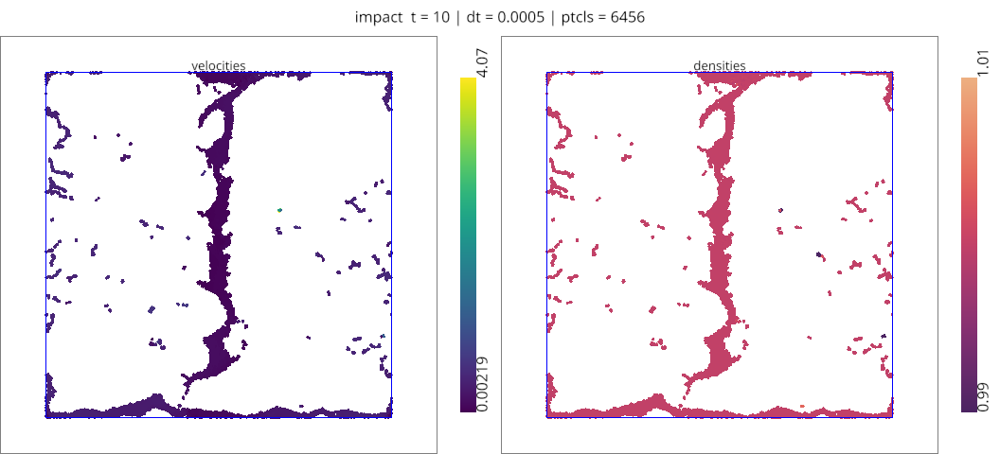 |
| 01. Impact (squares) | `impact` | [01-impact/impact_squares.ipynb](01-impact/impact_squares.ipynb) | 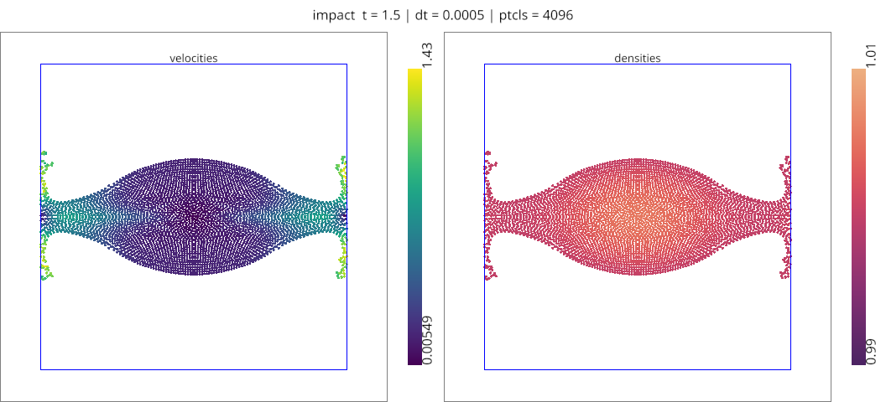 |
| 03. Rotating Square Patch | `squarePatch` | [03-rotating-square-patch.ipynb](03-rotating-square-patch.ipynb) | 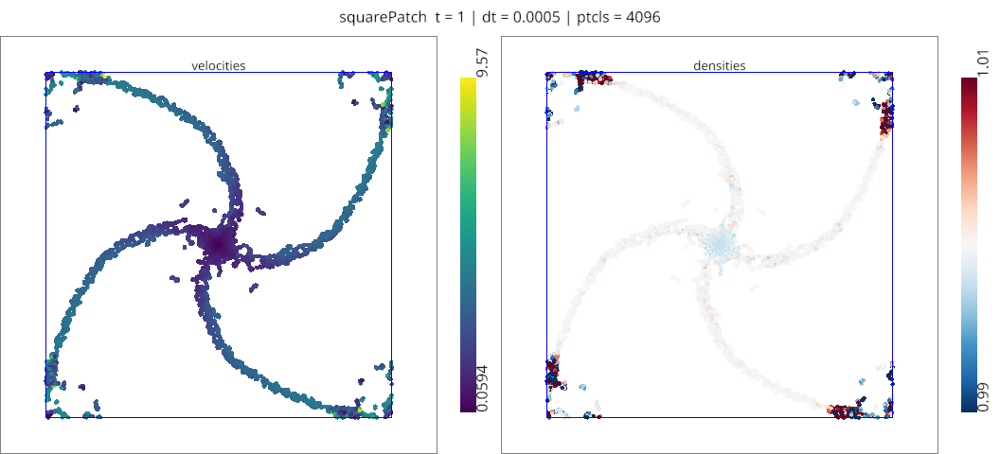 |
| 04. Oscillating Droplet | `droplet` | [04-oscillating-droplet.ipynb](04-oscillating-droplet.ipynb) | 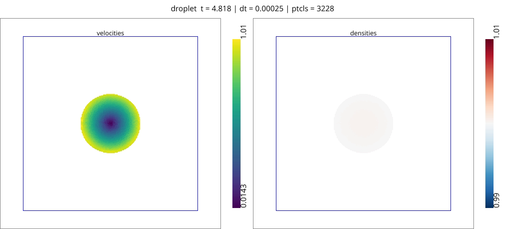 |
| 05. Taylor-Green Vortex | `tgv-wc` | [05-taylor-green-vortex.ipynb](05-taylor-green-vortex.ipynb) | 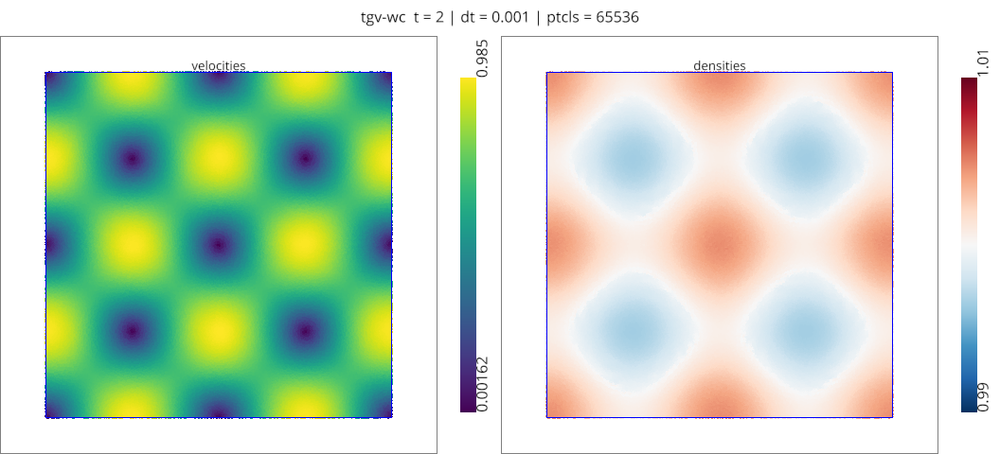 |
| 06. Random Flow (periodic) | `randomFlow` | [06-randomFlow/randomFlow_periodic.ipynb](06-randomFlow/randomFlow_periodic.ipynb) | 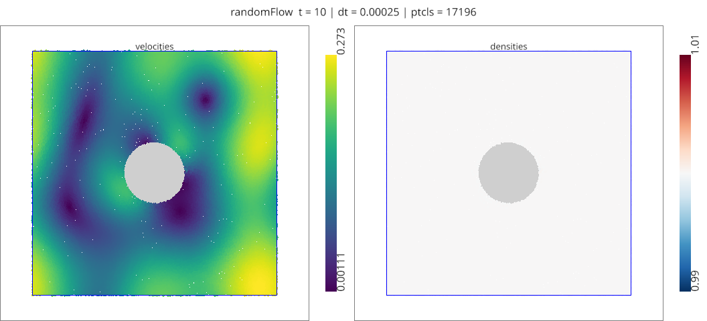 |
| 06. Random Flow (bounded) | `randomFlow` | [06-randomFlow/randomFlow_bounded.ipynb](06-randomFlow/randomFlow_bounded.ipynb) | 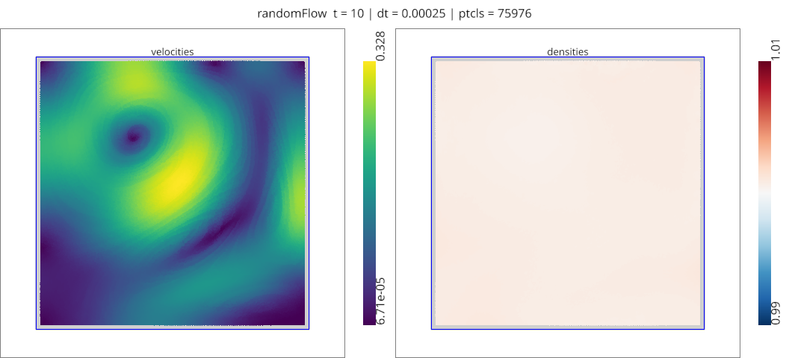 |
| 08. Kolmogorov Flow | `kolmogorov` | [08-kolmogorov-flow.ipynb](08-kolmogorov-flow.ipynb) | 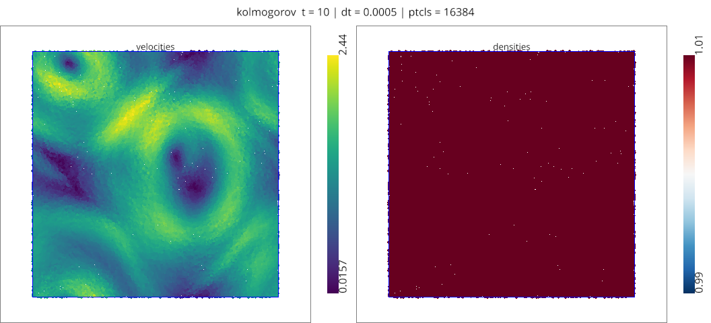 |
| 09. Lid-Driven Cavity | `ldc` | [09-lid-driven-cavity.ipynb](09-lid-driven-cavity.ipynb) | 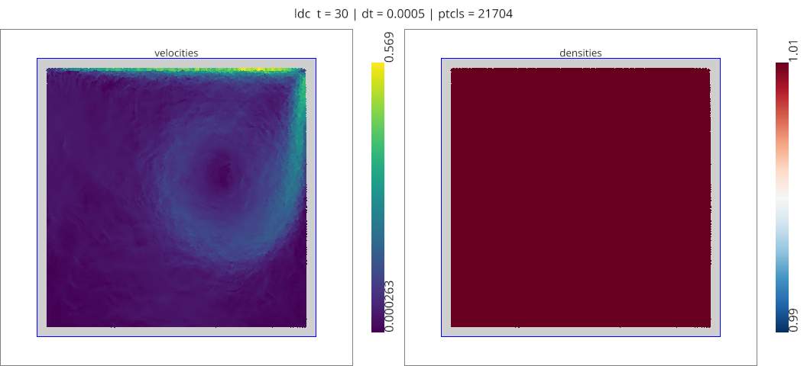 |
| 10. Moving Obstacle | `movingObstacle` | [10-moving-obstacle.ipynb](10-moving-obstacle.ipynb) | 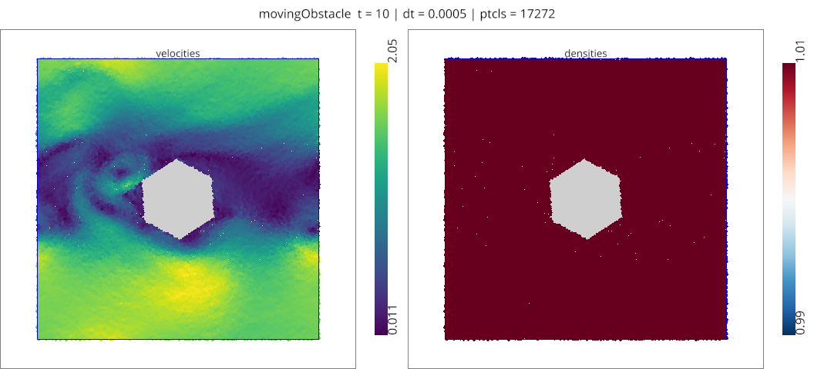 |
| 11. Driven Square | `drivenSquare` | [11-driven-square.ipynb](11-driven-square.ipynb) | 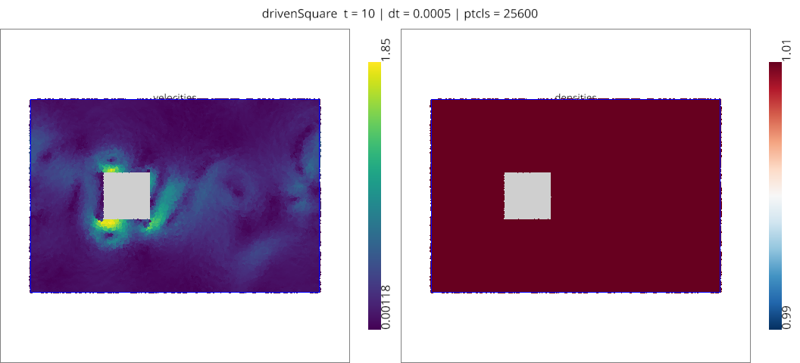 |
| 12. Dam Break | `dambreak` | [12-dambreak.ipynb](12-dambreak.ipynb) | 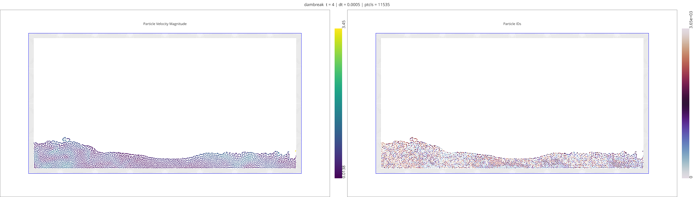 |
| 13. Open Channel Flow | `openFlow` | [13-open-flow.ipynb](13-open-flow.ipynb) | *(no render yet)* |

## Case Details (Preview + MP4)

### 01. Impact — spheres
Impact of two or more fluid bodies (2D). `--shape circle` selects the round
bodies shown here; `--shape box` gives the squares below. Own directory
([01-impact/](01-impact/)) holding both variants.


<video src="01-impact/outputs/01-impact_spheres.mp4" controls width="900"></video>

[Open MP4](01-impact/outputs/01-impact_spheres.mp4)

### 01. Impact — squares
The same case at `--shape box`, where the flat faces make the pressure wave from
first contact much sharper than in the round-body variant.


<video src="01-impact/outputs/01-impact_squares.mp4" controls width="900"></video>

[Open MP4](01-impact/outputs/01-impact_squares.mp4)

### 03. Rotating Square Patch
Rotating square patch of fluid (2D). A free-surface benchmark: the corners drive
strong negative pressure, so it is a standard test of whether a scheme holds a
surface together. Also runs at `--scheme divergenceFree` for the incompressible
comparison.


<video src="outputs/03-rotatingSquarePatch.mp4" controls width="900"></video>

[Open MP4](outputs/03-rotatingSquarePatch.mp4)

### 04. Oscillating Droplet
Oscillating droplet in a central potential (2D). The potential holds the droplet
together while it rings, so the oscillation period is the thing to measure.


<video src="outputs/04-oscillatingDroplet.mp4" controls width="900"></video>

[Open MP4](outputs/04-oscillatingDroplet.mp4)

### 05. Taylor-Green Vortex
Taylor-Green vortex (2D) with explicit viscosity, so the decay rate can be
checked against the analytic one. `tests/test_physics.py` pins that comparison.


<video src="outputs/05-taylorGreenVortex.mp4" controls width="900"></video>

[Open MP4](outputs/05-taylorGreenVortex.mp4)

### 06. Random Flow — periodic
Decaying divergence-free random flow (2D), fully periodic. The initial field is
divergence-free noise, which makes this the closest thing here to decaying
turbulence. Own directory ([06-randomFlow/](06-randomFlow/)).


<video src="06-randomFlow/outputs/06-randomFlowPeriodic.mp4" controls width="900"></video>

[Open MP4](06-randomFlow/outputs/06-randomFlowPeriodic.mp4)

### 06. Random Flow — bounded
The same case with `--bounded`, which replaces the periodic wrap with walls and
brings the boundary treatment into the picture.


<video src="06-randomFlow/outputs/06-randomFlowBounded.mp4" controls width="900"></video>

[Open MP4](06-randomFlow/outputs/06-randomFlowBounded.mp4)

### 08. Kolmogorov Flow
Kolmogorov flow (2D): a sinusoidally forced periodic box, driven to a statistical
steady state rather than decaying.


<video src="outputs/08-kolmogorovFlow.mp4" controls width="900"></video>

[Open MP4](outputs/08-kolmogorovFlow.mp4)

### 09. Lid-Driven Cavity
Lid-driven cavity (2D), the standard bounded-domain benchmark — a moving top wall
drives a recirculating vortex against three no-slip walls.


<video src="outputs/09-lidDrivenCavity.mp4" controls width="900"></video>

[Open MP4](outputs/09-lidDrivenCavity.mp4)

### 10. Moving Obstacle
Flow past a spinning rigid obstacle (2D). Exercises the rigid-body coupling and
the boundary conditions on a body that both moves and rotates.


<video src="outputs/10-movingObstacle.mp4" controls width="900"></video>

[Open MP4](outputs/10-movingObstacle.mp4)

### 11. Driven Square
Square rigid body driven back and forth through fluid (2D). The reversal is the
interesting part: the wake the body built up gets driven back through it.


<video src="outputs/11-drivenSquare.mp4" controls width="900"></video>

[Open MP4](outputs/11-drivenSquare.mp4)

### 12. Dam Break
Dam break with optional obstacle (2D), the classic violent free-surface case.
`tests/test_physics.py` pins its density bounds and gravitational work.


<video src="outputs/12-dambreak.mp4" controls width="900"></video>

[Open MP4](outputs/12-dambreak.mp4)

### 13. Open Channel Flow
Open channel flow past an obstacle (2D), using inlet and outlet regions rather
than a closed domain.

*No render ships for this case yet.* Its notebook is also the last one in this
family still on the pre-`warpSPHBootstrap` style — see
[MIGRATION_PLAN.md](MIGRATION_PLAN.md). To produce one:

```bash
scripts/render_examples.py --only 13-open-flow
```

---

## Regenerating these

All of the media above is produced by
[`scripts/render_examples.py`](../../scripts/render_examples.py), which re-runs
each example's `.py` wrapper at its shipped settings and files the GIF, MP4 and
final-frame PNG into the `outputs/` directory the notebook references:

```bash
scripts/render_examples.py --list           # what would run, and where it lands
scripts/render_examples.py --only 12-dambreak
scripts/render_examples.py                  # everything (hours)
```
